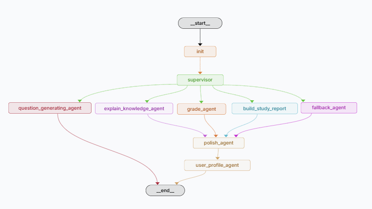
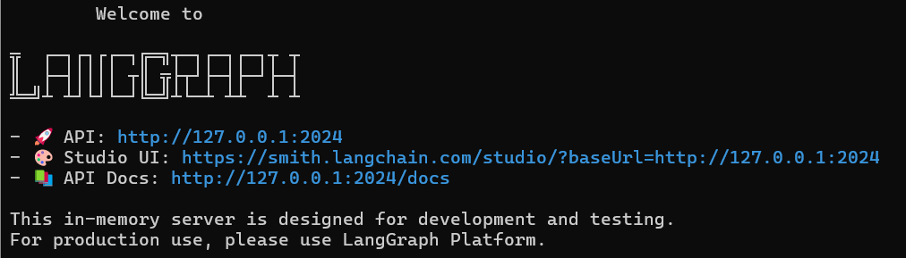
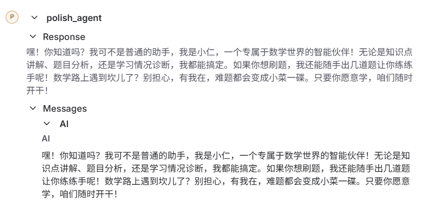
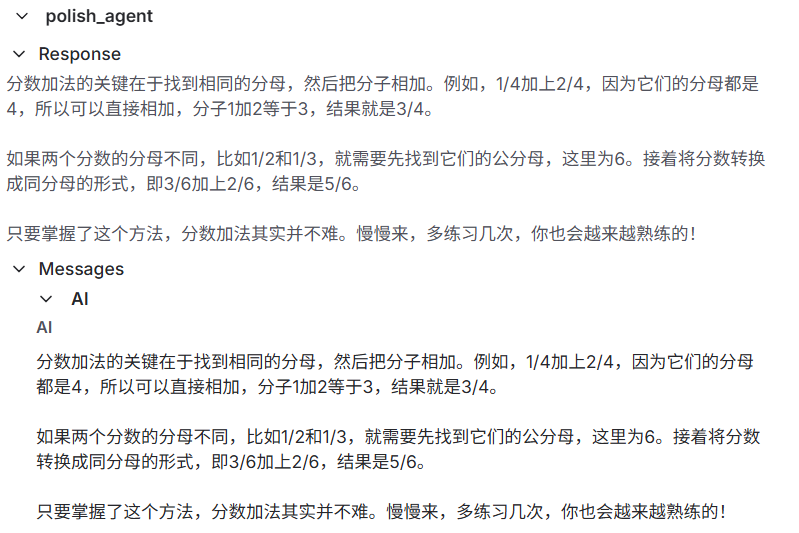
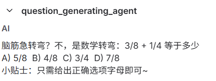
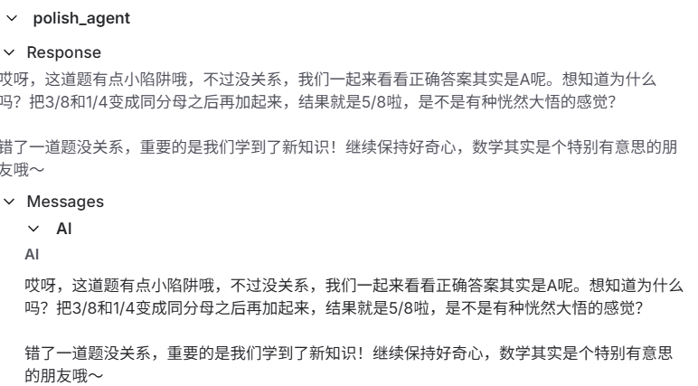
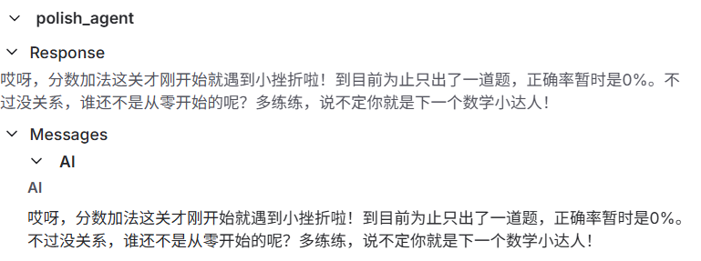

# MathPal_houren — 小学数学AI伴学系统

[](https://www.python.org/)[](https://langchain-ai.github.io/langgraph/)[](LICENSE)[](https://help.aliyun.com/zh/qwen/)[](https://en.wikipedia.org/wiki/Retrieval-augmented_generation)[](https://github.com/langchain-ai/langgraph)

---

**MathPal_houren**是一个基于 **LangGraph**和**Qwen模型**构建的智能小学数学学习助手，专为五年级学生设计，支持知识点讲解、智能出题、答题判分、学情分析与个性化反馈等功能。

---

## 🌟项目介绍

MathPal_houren 是一个面向小学数学教育场景的 AI 伴学系统。它利用大语言模型（LLM）与检索增强生成（RAG）技术，结合学生画像与学习行为，提供个性化、互动式的学习体验。

核心功能包括：

- 📘 **知识点讲解**：针对用户提问，精准讲解小学数学知识点（当前支持五年级上册内容）。
- 📝 **智能出题**：根据当前学习内容动态生成选择题。
- ✅ **自动判题**：判断用户答题正误，并提供解析。
- 📊 **学情报告**：汇总学习记录，生成掌握情况报告。
- 💬 **风格适配**：根据学生偏好优化语言表达，提升亲和力。

### 系统结构

本项目采用主管代理，整体架构为：

```
init → supervisor → {explain | generate | grade | report | fallback} → polish → user_profile → END
```



### 节点介绍

| 节点                        | 功能                           |
| --------------------------- | ------------------------------ |
| `supervisor`                | 分析用户意图，提取知识点       |
| `explain_knowledge_agent`   | 讲解指定数学知识点             |
| `question_generating_agent` | 动态生成一道选择题             |
| `grade_agent`               | 判定用户答案正误并反馈         |
| `build_study_report`        | 生成学习掌握情况报告           |
| `fallback_agent`            | 处理非数学话题，引导回学习场景 |
| `polish_agent`              | 根据学生语言风格优化回答       |
| `user_profile_agent`        | 更新并维护用户学习画像         |

---

## 🚀快速使用

### 1. 克隆项目

```
git clone https://github.com/feiyu1104/MathPal_houren.git
cd MathPal_houren
```

### 2. API申请

你需要申请以下两个 API 密钥：

- **Qwen API**（通义千问）：[申请地址](https://bailian.console.aliyun.com/&tab=doc?spm=5176.29597918.J_SEsSjsNv72yRuRFS2VknO.4.4ad67b08WPVLoI&tab=doc#/doc/?type=model&url=https%3A%2F%2Fhelp.aliyun.com%2Fdocument_detail%2F2840915.html&renderType=iframe)
- **LangSmith API**：[申请地址](https://smith.langchain.com/settings)

### 3. 项目部署

复制以下命令到终端来下载代码

```shell
# 创建虚拟环境
conda create -n 环境名字 python=3.11
conda activate 环境名字
# 下载依赖
pip install -r requirements.txt
```

### 4. 安装LangGraph CLI

```shell
# Python >= 3.11 is required.
pip install --upgrade "langgraph-cli[inmem]"
```

### 5. 创建 LangGraph 应用程序 

输入以下命令，创建一个new-langgraph-project-python模板

```
langgraph new path/to/your/app --template new-langgraph-project-python
```

打开新 LangGraph 应用的根目录中，输入以下命令安装依赖项

```shell
pip install -e . 
```

- 将本项目中的 `.env` 文件复制到 `app/` 根目录，并填入你的 API 密钥。
- 将 `graph.py` 复制到 `src/agent/graph.py`。
- 将 `vectorstore/` 和 `primary_math_docs/` 目录复制到项目根目录。

> 💡 若需更换教材范围（如换成四年级），请： 
>
> 1. 将对应知识点 `.txt` 文件放入 `primary_math_docs/`
> 2. 修改 `vector_make.py` 中的路径
> 3. 运行 `python vector_make.py` 重建向量库
> 4. 更新 `graph.py` 中的向量库路径

### 6. 运行LangGraph Server 

```shell
langgraph dev
```

即可自动打开网页，你可以在这里输入消息，查看系统运行



---

## 🧪 示例运行

输入”你是谁“



输入”你能讲一讲分数加法吗“



输入”出一道题“



输入”答案是B“



输入”我学的怎么样“



---

## ⚠️ 注意事项

4. 本项目默认使用 **Qwen 大模型**，你可自行替换为其他兼容 LangChain 的 LLM。
2. 向量知识库基于 **小学五年级上册数学教材**，如需扩展，请按上述步骤更新文档与向量库。
3. 项目仅包含核心逻辑，**未提供单元测试**，建议通过 `langgraph dev` 本地调试。
4. 所有数据处理均在本地完成，**不上传用户隐私信息**。

---

## ❤️ 致谢

感谢 [LangGraph ](https://langchain-ai.github.io/langgraph/)、[Qwen ](https://help.aliyun.com/zh/qwen/)和 [LangSmith ](https://smith.langchain.com/)提供的强大工具支持！

欢迎贡献代码、提交 Issue 或提出改进建议！让我们一起打造更好的 AI 教育助手 🌱

---

感谢你的使用，如果你喜欢这个项目，请 ⭐️ Star 支持我们！

